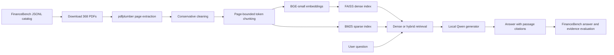

# FinanceBench Retrieval-Augmented Generation

An end-to-end, locally executable RAG system for answering questions about
financial filings from the open-source
[FinanceBench](https://github.com/patronus-ai/financebench) dataset.

The project downloads and parses the FinanceBench PDF collection, removes
repeated page boilerplate, creates structure-aware token chunks, embeds them
with BGE-small, retrieves evidence with FAISS (optionally fused with BM25), and
generates cited answers with local Qwen models served by Ollama. Evaluation
covers retrieval accuracy, exact evidence-text coverage, answer correctness,
citations, refusals, and controlled system ablations.

## Pipeline



## Implemented components

- Automated FinanceBench PDF acquisition with retries, manifest checkpoints,
  PDF magic-byte validation, and repository fallback.
- Full-corpus parsing with `pdfplumber`: 368 documents and 54,120 pages.
- Auditable cleaning of Unicode, whitespace, repeated headers, footers, and
  page numbers.
- Page-bounded recursive chunking that preserves paragraphs, lines, sentences,
  and financial table rows where possible.
- BGE-small dense embeddings and exact cosine-similarity search with FAISS.
- Optional BM25 retrieval and reciprocal-rank fusion.
- Local, grounded answer generation with Qwen2.5 3B or 7B through Ollama.
- Explicit passage references such as `[1]` in generated answers.
- Retrieval evaluation at `k = 1, 3, 5, 10, 20`.
- Evidence-text recall, page hit, document hit, MRR, answer judging, numeric
  matching, citation, and refusal metrics.
- Controlled experiments for chunk size, overlap, structure preservation,
  dense/BM25 fusion, retrieval depth, and generator size.

The detailed methodological rationale and experimental conclusions are in
[`docs/decisions.md`](docs/decisions.md).

## Repository layout

```text
configs/                 YAML configurations for chunking, embedding and generation
docs/decisions.md        Methodology decisions and experimental findings
src/ingest/              Dataset manifest, downloading, parsing and cleaning
src/chunk/               Recursive and fixed-window chunk construction
src/retrieval/           FAISS, BM25, dense and hybrid retrieval
src/generation/          Grounded Qwen generation and end-to-end RAG runners
src/eval/                Retrieval, answer and generator-comparison evaluation
src/experiments/         Controlled chunking-pilot utilities
data/financebench/       FinanceBench JSONL inputs (not committed)
data/raw_pdfs/           Downloaded PDFs (not committed)
data/parsed/             Raw page-level Parquet files (not committed)
data/clean/              Clean page-level Parquet files (not committed)
data/chunks/             Chunk Parquet files (not committed)
data/index/              FAISS and BM25 indexes (not committed)
runs/                    Generated answers and evaluation outputs (not committed)
```

All commands below assume that they are run from the repository root.

## Requirements

### Software

- Python 3.11 or newer. Development and final verification used Python 3.14.6.
- Git.
- Approximately 4 GB of free space for the PDFs, page data, chunks, indexes,
  and Python environment.
- Additional space for local Qwen models.
- [Ollama](https://ollama.com/download) for answer generation and LLM judging.

The retrieval and evaluation stages do not require a paid API. All models run
locally. The first Sentence Transformers run downloads
`BAAI/bge-small-en-v1.5` from Hugging Face.

### Hardware

The pipeline supports:

- Apple Silicon through PyTorch MPS;
- NVIDIA CUDA;
- CPU fallback.

The completed baseline was built on an Apple Silicon Mac. Full-corpus parsing
took approximately 91 minutes, baseline embedding approximately 32 minutes,
and 3B answer generation approximately 17 seconds per question. Times vary
substantially by machine.

## Installation

Create an isolated Python environment:

```bash
python3 -m venv .venv
source .venv/bin/activate
python -m pip install --upgrade pip
python -m pip install -r requirements.txt
```

Install Ollama using its
[official instructions](https://ollama.com/download), then obtain the local
models:

```bash
ollama pull qwen2.5:3b
ollama pull qwen2.5:7b
```

The 3B model is sufficient to run the baseline RAG. The 7B model is needed for
the answer judge and generator-size experiment.

Start Ollama before generation or answer evaluation:

```bash
ollama serve
```

In another terminal, verify that it is available:

```bash
ollama list
```

## Obtain FinanceBench

The project expects these files:

```text
data/financebench/financebench_document_information.jsonl
data/financebench/financebench_open_source.jsonl
```

They can be copied from the official repository:

```bash
git clone --depth 1 https://github.com/patronus-ai/financebench.git /tmp/financebench-source
mkdir -p data/financebench
cp /tmp/financebench-source/data/financebench_document_information.jsonl data/financebench/
cp /tmp/financebench-source/data/financebench_open_source.jsonl data/financebench/
```

The first file is the document catalog; the second contains the 150 questions,
gold answers, and gold evidence spans.

## Reproduce the baseline

### 1. Build the download manifest

```bash
python src/ingest/build_manifest.py
```

Output: `data/manifest.csv`.

### 2. Download the PDFs

SEC EDGAR requests should identify the person running the script. Set a
descriptive user agent with your own contact address:

```bash
export FINANCEBENCH_USER_AGENT="financebench-rag educational-research your-email@example.com"
python src/ingest/download_pdfs.py
```

Some original investor-relations links are no longer reliable. Download any
missing PDFs from FinanceBench's official repository mirror:

```bash
python src/ingest/download_all_from_repo.py
```

Output: `data/raw_pdfs/*.pdf`.

### 3. Parse the PDFs

```bash
python src/ingest/parse_pdfs.py
```

Outputs:

- `data/parsed/{doc_name}.parquet`
- `data/parse_manifest.csv`

The parser is resumable: existing document Parquet files are skipped.

### 4. Clean page text

Inspect a document without writing changes:

```bash
python src/ingest/clean_pages.py --dry-run APPLE_2022_10K
```

Clean the complete corpus:

```bash
python src/ingest/clean_pages.py
```

Outputs:

- `data/clean/{doc_name}.parquet`
- `data/clean_manifest.csv`

### 5. Build baseline chunks

Inspect sample chunks first:

```bash
python src/chunk/build_chunks.py --config configs/chunk_baseline.yaml --sample APPLE_2022_10K
```

Build the complete chunk set:

```bash
python src/chunk/build_chunks.py --config configs/chunk_baseline.yaml
```

Output: `data/chunks/s256_o50.parquet`.

The baseline uses 256-token recursive chunks, a 50-token overlap, and never
crosses page boundaries.

### 6. Build the dense FAISS index

```bash
python src/retrieval/build_index.py --config configs/embed_baseline.yaml
```

Output:

```text
data/index/bge-small__s256_o50/
├── index.faiss
├── meta.parquet
└── config.json
```

The index is exact `IndexFlatIP` over normalized vectors, making inner product
equivalent to cosine similarity.

`configs/embed_baseline.yaml` uses fp16 for Apple MPS or CUDA. On a CPU-only
machine, copy that configuration, add `device: cpu`, and change `fp16: false`
before building.

### 7. Test retrieval

```bash
python src/retrieval/retriever.py \
  --index data/index/bge-small__s256_o50 \
  --k 5 \
  --query "What was Apple's FY2022 net sales?"
```

### 8. Evaluate dense retrieval

CPU query encoding is the most stable evaluation mode across systems:

```bash
python src/eval/eval_retrieval.py \
  --index data/index/bge-small__s256_o50 \
  --device cpu
```

Outputs:

- `runs/retrieval_bge-small__s256_o50.jsonl`
- `runs/retrieval_bge-small__s256_o50.csv`

The evaluation reports document hit, page hit, page recall, MRR, evidence hit,
evidence token recall, and evidence trigram recall.

### 9. Build and evaluate hybrid retrieval

```bash
python src/retrieval/build_bm25.py \
  --chunks data/chunks/s256_o50.parquet \
  --name s256_o50
```

Evaluate the selected 90% dense / 10% BM25 fusion:

```bash
python src/eval/eval_retrieval.py \
  --index data/index/bge-small__s256_o50 \
  --bm25 data/index/bm25__s256_o50 \
  --dense-weight 0.9 \
  --device cpu
```

The dense baseline remains the primary end-to-end configuration because the
hybrid improvement was small and statistically inconclusive.

### 10. Ask the RAG system a question

Ensure Ollama is running and `qwen2.5:3b` is installed:

```bash
python src/generation/rag.py \
  --index data/index/bge-small__s256_o50 \
  --gen-config configs/gen_baseline.yaml \
  --query "What was Apple's FY2022 net sales?"
```

Replay a specific FinanceBench question:

```bash
python src/generation/rag.py \
  --index data/index/bge-small__s256_o50 \
  --gen-config configs/gen_baseline.yaml \
  --fb-id financebench_id_03029
```

The answer is constrained to the retrieved passages and must cite context
numbers such as `[1]`. If the evidence is absent, the model is instructed to
abstain.

### 11. Generate the FinanceBench answer set

Start with a small smoke test:

```bash
python src/generation/run_rag.py \
  --index data/index/bge-small__s256_o50 \
  --gen-config configs/gen_baseline.yaml \
  --limit 3
```

Then run all 150 questions:

```bash
python src/generation/run_rag.py \
  --index data/index/bge-small__s256_o50 \
  --gen-config configs/gen_baseline.yaml
```

Output: `runs/answers_qwen2.5-3b__bge-small__s256_o50.jsonl`.

Generation is resumable. Repeating the command skips completed question IDs.
Use `--overwrite` only when intentionally replacing an existing run.

### 12. Evaluate generated answers

```bash
python src/eval/eval_answers.py \
  --answers runs/answers_qwen2.5-3b__bge-small__s256_o50.jsonl \
  --judge qwen2.5:7b
```

Outputs:

- `runs/answers_eval_qwen2.5-3b__bge-small__s256_o50.jsonl`
- `runs/answers_eval_qwen2.5-3b__bge-small__s256_o50_summary.csv`

The answer evaluator combines deterministic numeric matching with a separate
local 7B judge. It also reports correctness by question type and by whether
retrieval found a gold evidence page.

## Reproduce the experiments

### Retrieval depth

`eval_retrieval.py` evaluates `k = 1, 3, 5, 10, 20` from one top-20 retrieval
pass, so the effect of retrieval depth is present in every retrieval CSV.

### Dense/BM25 fusion sweep

```bash
python src/eval/eval_hybrid_sweep.py \
  --dense data/index/bge-small__s256_o50 \
  --bm25 data/index/bm25__s256_o50 \
  --weights 0,0.5,0.7,0.8,0.9,1
```

Output: `runs/retrieval_hybrid_weight_sweep.csv` plus one per-question JSONL
for each weight.

### Controlled chunking pilot

Create a deterministic 30-question pilot with 10 questions from each
FinanceBench question type:

```bash
python src/experiments/select_pilot.py \
  --input data/financebench/financebench_open_source.jsonl \
  --output data/financebench/financebench_pilot_30.jsonl
```

Reuse baseline vectors to create the paired pilot baseline:

```bash
python src/experiments/subset_index.py \
  --source-index data/index/bge-small__s256_o50 \
  --eval-jsonl data/financebench/financebench_pilot_30.jsonl \
  --name bge-small__s256_o50_pilot
```

Build the three controlled alternatives:

```bash
python src/chunk/build_chunks.py --config configs/chunk_size384_pilot.yaml
python src/chunk/build_chunks.py --config configs/chunk_overlap0_pilot.yaml
python src/chunk/build_chunks.py --config configs/chunk_fixed_pilot.yaml

python src/retrieval/build_index.py --config configs/embed_size384_pilot.yaml
python src/retrieval/build_index.py --config configs/embed_overlap0_pilot.yaml
python src/retrieval/build_index.py --config configs/embed_fixed_pilot.yaml
```

Embedding shards are saved under each index directory. If indexing is
interrupted, repeat the same command; completed shards are reused.

Evaluate all four variants:

```bash
python src/eval/eval_retrieval.py \
  --index data/index/bge-small__s256_o50_pilot \
  --eval-jsonl data/financebench/financebench_pilot_30.jsonl \
  --device cpu

python src/eval/eval_retrieval.py \
  --index data/index/bge-small__s384_o50_pilot \
  --eval-jsonl data/financebench/financebench_pilot_30.jsonl \
  --device cpu

python src/eval/eval_retrieval.py \
  --index data/index/bge-small__s256_o0_pilot \
  --eval-jsonl data/financebench/financebench_pilot_30.jsonl \
  --device cpu

python src/eval/eval_retrieval.py \
  --index data/index/bge-small__s256_o50_fixed_pilot \
  --eval-jsonl data/financebench/financebench_pilot_30.jsonl \
  --device cpu
```

Create the paired bootstrap comparison:

```bash
python src/experiments/summarize_chunking.py \
  --baseline runs/retrieval_bge-small__s256_o50_pilot.jsonl \
  --variant size384 runs/retrieval_bge-small__s384_o50_pilot.jsonl \
  --variant overlap0 runs/retrieval_bge-small__s256_o0_pilot.jsonl \
  --variant fixed_windows runs/retrieval_bge-small__s256_o50_fixed_pilot.jsonl \
  --output runs/chunking_pilot_summary.csv
```

### Generator-size experiment

Generate 7B answers from the exact contexts previously retrieved for the 3B
run. Restricting the main comparison to gold-page hits isolates generation
quality from retrieval failure:

```bash
python src/generation/regenerate_from_contexts.py \
  --source runs/answers_qwen2.5-3b__bge-small__s256_o50.jsonl \
  --gen-config configs/gen_qwen7b.yaml \
  --page-hit-only
```

Run blinded pairwise judging with both models and both A/B orders:

```bash
python src/eval/compare_generators.py \
  --answers-3b runs/answers_qwen2.5-3b__bge-small__s256_o50.jsonl \
  --answers-7b runs/answers_qwen2.5-7b__bge-small__s256_o50.jsonl \
  --judge qwen2.5:3b

python src/eval/compare_generators.py \
  --answers-3b runs/answers_qwen2.5-3b__bge-small__s256_o50.jsonl \
  --answers-7b runs/answers_qwen2.5-7b__bge-small__s256_o50.jsonl \
  --judge qwen2.5:3b \
  --swap-order

python src/eval/compare_generators.py \
  --answers-3b runs/answers_qwen2.5-3b__bge-small__s256_o50.jsonl \
  --answers-7b runs/answers_qwen2.5-7b__bge-small__s256_o50.jsonl \
  --judge qwen2.5:7b

python src/eval/compare_generators.py \
  --answers-3b runs/answers_qwen2.5-3b__bge-small__s256_o50.jsonl \
  --answers-7b runs/answers_qwen2.5-7b__bge-small__s256_o50.jsonl \
  --judge qwen2.5:7b \
  --swap-order
```

Summarize objective behavior, pairwise preferences, position sensitivity, and
order-robust preferences:

```bash
python src/eval/summarize_generator_experiment.py \
  --answers-3b runs/answers_qwen2.5-3b__bge-small__s256_o50.jsonl \
  --answers-7b runs/answers_qwen2.5-7b__bge-small__s256_o50.jsonl \
  --judge-3b runs/generator_pairwise_qwen2.5-3b_page-hit.jsonl \
  --judge-7b runs/generator_pairwise_qwen2.5-7b_page-hit.jsonl \
  --judge-3b-swapped runs/generator_pairwise_qwen2.5-3b_page-hit-swapped.jsonl \
  --judge-7b-swapped runs/generator_pairwise_qwen2.5-7b_page-hit-swapped.jsonl
```

## Main findings

- Dense retrieval substantially outperformed BM25-only retrieval.
- A 90% dense / 10% BM25 fusion produced a small early-rank improvement, but
  the difference was not statistically significant.
- On the full 150-question set, dense retrieval achieved page hit@10 of 0.307
  and evidence hit@10 of 0.293.
- Retrieval was the primary bottleneck: answer accuracy was 0.217 when the
  gold page was retrieved, compared with 0.077 when it was missed.
- In the chunking pilot, removing overlap significantly reduced MRR.
- Larger 384-token chunks improved top-10 evidence coverage and reduced index
  size, but weakened early ranking.
- Fixed token windows were competitive for retrieval, but produce less
  readable generator context and can split sentences or table rows.
- Qwen2.5 7B improved citation behavior over 3B, but its correctness advantage
  was inconclusive after controlling for answer order and judge instability.

The recommended primary configuration is therefore:

```text
parser:       pdfplumber
chunking:     recursive, page-bounded, 256 tokens, 50-token overlap
embeddings:   BAAI/bge-small-en-v1.5
index:        normalized FAISS IndexFlatIP
retrieval:    dense top 10
generator:    Qwen2.5 3B through Ollama
```

Recursive 384/50 is the strongest candidate for a future full-dataset
chunking validation.

## Reproducibility notes

- Random and generation seeds are fixed at 42 and 0 where applicable.
- Generation uses temperature 0.
- Every generated-answer and pairwise-judge runner is resumable.
- Index directories store their model, normalization, device, count, and
  build timestamp in `config.json`.
- Raw data, model indexes, and generated runs are excluded from Git because of
  their size. Recreate them with the commands above.
- The chunking experiment is a paired 30-question pilot over 26 documents.
  Its absolute scores must not be compared directly with full-corpus scores.
- LLM-as-a-judge results are reported together with deterministic numeric
  matching and order-swap controls because local judges showed substantial
  position sensitivity.

## Known limitations

- PDF table structure is represented as extracted text rows, not as a formal
  table schema.
- Scanned PDFs requiring OCR are not explicitly supported.
- Dense retrieval sometimes confuses similar fiscal years or filings.
- The answer generator cannot recover evidence that retrieval did not return.
- FinanceBench frequently requires arithmetic and multi-step financial
  reasoning; the local 3B model remains weak on these questions.
- The answer judge is itself a language model and is not perfectly stable.
- The chunking ablation uses a pilot subset rather than all 150 questions.

## Troubleshooting

### Ollama connection error

Start the service and confirm the required models are installed:

```bash
ollama serve
ollama list
```

### CPU-only embedding

Do not use fp16 on CPU. Copy the embedding YAML, then set:

```yaml
device: cpu
fp16: false
```

### MPS instability

Use `--device cpu` for retrieval evaluation. Query encoding is inexpensive,
and the evaluator explicitly uses eager attention with one CPU thread.

### Interrupted indexing

Pilot embedding configurations use 1,024-vector shards. Re-run the same
`build_index.py` command to continue from saved shards.

### Interrupted generation

Re-run `run_rag.py`, `regenerate_from_contexts.py`, or
`compare_generators.py` with the same arguments. Completed question IDs are
skipped automatically.

## Dataset citation

If using FinanceBench, cite:

```bibtex
@misc{islam2023financebench,
  title={FinanceBench: A New Benchmark for Financial Question Answering},
  author={Pranab Islam and Anand Kannappan and Douwe Kiela and
          Rebecca Qian and Nino Scherrer and Bertie Vidgen},
  year={2023},
  eprint={2311.11944},
  archivePrefix={arXiv},
  primaryClass={cs.CL}
}
```
